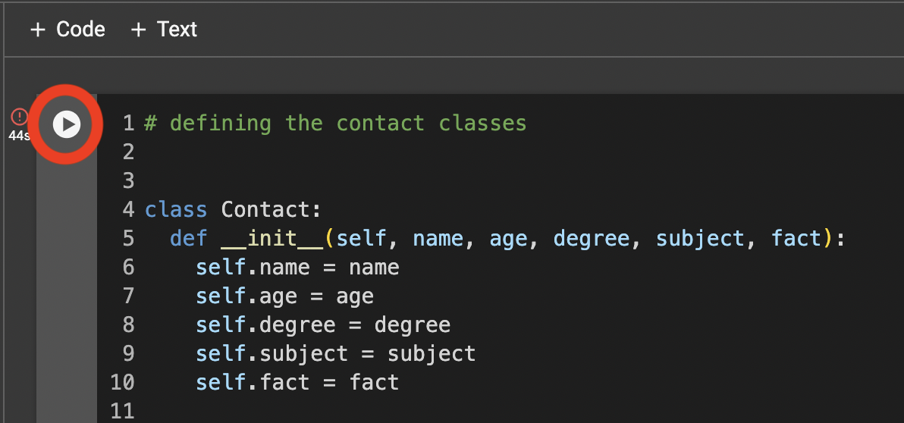
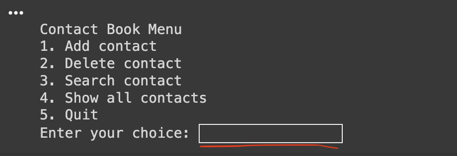

# Secret Classmate
> Access to prototype [_here_](C_Salt_A2_Secret_Classmate.ipynb). <!-- If you have the project hosted somewhere, include the link here. -->

## Table of contents
* [Introduction](#Introduction)
* [Technologies](#Technologies)
* [Launch](#Launch)
* [Screenshots](#Screenshots)
* [Usage](#Usage)
* [Project Status](#Project-Status)
* [Acknowledgements](#Acknowledgements)

## Introduction 
The Secret Classmate is an prototype created to solve an all too common problem: forgetting people's names. As a University student doing 4 class, with meeting anywhere between 4-8 people per lesson, there are alot of names, ages, degrees, and ice breaker fun facts to learn and remember about these people, let alone also paying attention to the content within the class. So, I decided to make an interactive contact book to store all of this information on. Be able to quickly look up people, read their contact information and then continue the conversation without it being awkward. 

## Technologies Used
- Coded using Python language on Google Colab

## Launch
- Launch the program by following the below screenshot pathway

## Screenshots
1. Click link at the top of the Read Me File
Press this button in the top left corner:

2. Then, press the Play button:
   

3. Once loaded, scroll to bottom (it may take you there automatically)
- you should see this menu returned

4. Continue following the instructions by typing your answer then pressing enter

## Usage
- Originally created for me (a student) to remember and store the names and information of people in my multiple classes. 
- However, anyone wanting to store the names (age, degree, fun fact etc) of people in situations where this is not the main memory priority, will be able to use it in their own way.
- It can also just serve as a general memory aid for teachers, educators, people who work in teams or groups and other similar settings.

## Project Status
- This project is incomplete
- For example, my stretch goals that I did not achieve were searching people by subject, and being able to send an invitation for a contact that I could add to the book.

## Acknowledgements
- This idea was inspired by a contact book created by Aminah Mardiyyah Rufai. [ here ](https://mardiyyah.medium.com/building-a-simple-phonebook-learnpythonthroughprojects-series-10-af56d527f463)
- sources

  

