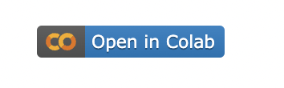

# Secret Classmate
> Outline a brief description of your project.
> Live demo [_here_](C_Salt_A2_Secret_Classmate.ipynb). <!-- If you have the project hosted somewhere, include the link here. -->

## Table of contents
* [Introduction project aim](#Introduction)
* [Technologies which python version, colab etc](#Technologies)
* [Launch](#Launch)
* [Screenshots](#Screenshots)
* [Usage](#Usage)
* [Project Status](#Project-Status)
* [Acknowledgements](#Acknowledgements)

## Introduction 
######examples of use (useful for students or teachers who need to keep track of people)
## Technologies Used
- Python
- Google Colab

## Launch
- scroll to bottom

## Screenshots1
1. Click link at the top of the Read Me File
Press this button in the top left corner:

2. Then, press the Play button:
   

3. Once loaded, scroll to bottom (it may take you there automatically)
- you should see this menu returned

## Usage
- Students, how i use it
- Teachers
- General memory aid

## Project Status
- stretch goals not achieved

## Acknowledgements
- inspirations
- sources

  

